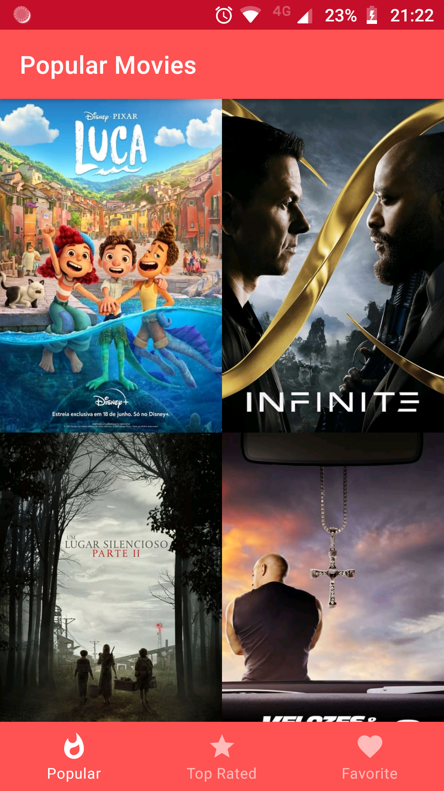
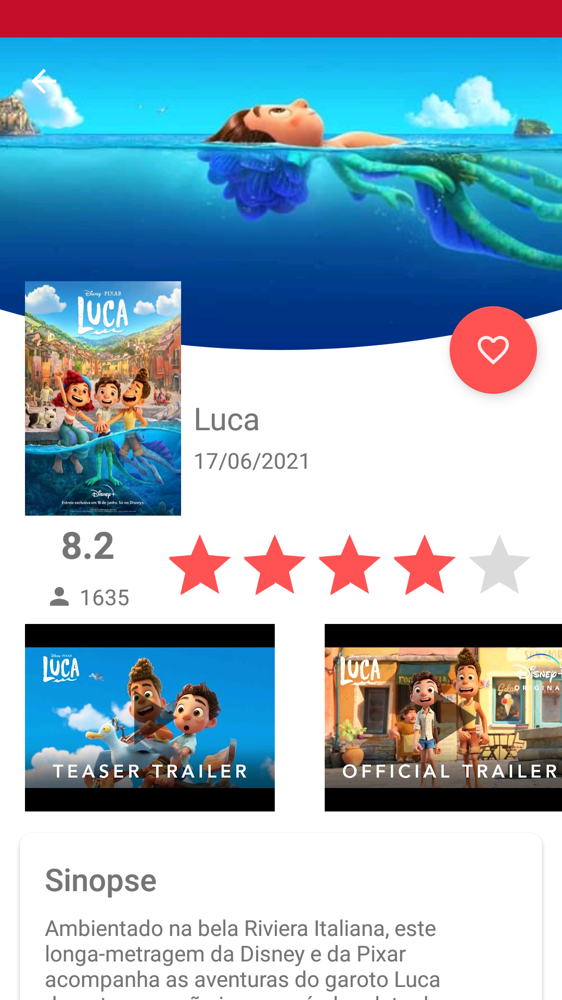

# Popular Movies App 

[](https://sonarcloud.io/dashboard?id=diegodim_PopularMovies)

This app has been build using a Model-View-Presenter (MVP). 

 

## How to build the app

1. Clone this repository:

```
git clone https://github.com/diegodim/PopularMovies
```

2. Open Android Studio and open the project.

3. Get a API key from [The Movie Database](https://www.themoviedb.org/) website.

4. Then inside the `gradle.properties` file replace `tmdb_api_key` with your API key.


## Languages, libraries and tools used

* [Kotlin](https://kotlinlang.org/docs/home.html)
* Android Support Libraries
* [Dagger2](https://github.com/google/dagger)
* [RxJava3](https://github.com/ReactiveX/RxJava)
* [RxAndroid3](https://github.com/ReactiveX/RxAndroid)
* [Retrofit](https://github.com/square/retrofit)
* [OkHttp](https://github.com/square/okhttp)
* [Gson](https://github.com/google/gson)
* [Glide](https://github.com/bumptech/glide)
* [Mockito](https://github.com/mockito/mockito) 
* [LeakCanary](https://square.github.io/leakcanary/) 


